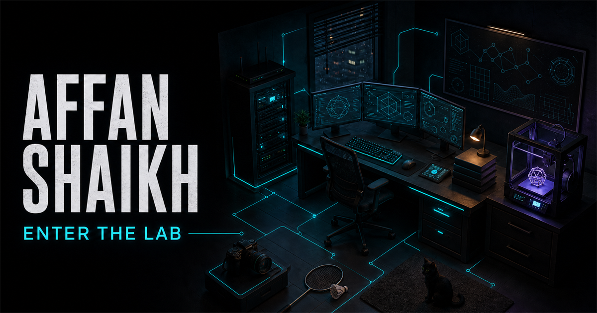

# Affan Shaikh Portfolio

A dark, multi-page personal portfolio for Affan Shaikh, a Networking and Cybersecurity student at Ontario Tech University.

[View the live portfolio](https://affan-shaikh-portfolio.sil6428-archtech.workers.dev)



## Overview

The site presents my technical work, education, experience, and interests without relying on a profile photo. The homepage is a full-screen Three.js cyber lab where each object represents part of my work or personality.

Visitors move the pointer to subtly shift the diorama, drag to orbit within a restrained range, and select any object directly. Each selection follows a curved, eased camera path into a composed close-up before opening the complete file without leaving the scene. Earlier focused routes remain available as unlisted fallbacks.

## Pages

| Route | Purpose |
| --- | --- |
| `/` | Full-screen interactive 3D cyber lab |
| `/info` | Education, skills, experience, volunteer work, resume, and contact links |
| `/interests` | Personal interests and interactive visual cards |
| `/work/archtech` | Archtech case study and current work-in-progress status |
| `/work/ssik` | SSIK consulting website case study |
| `/interests/badminton` | Regional badminton experience |
| `/interests/3d-printing` | 3D printing and design projects |
| `/interests/reading` | Current reading interests |
| `/interests/photography` | Photography and VSCO link |
| `/interests/home-lab` | Proxmox home-lab plans |

## Features

- A focused, full-screen homepage without a conventional header, footer, or visible directory bar
- Expandable project and interest pages
- Custom CSS illustrations for badminton and 3D printing
- Full-screen Three.js cyber lab with selectable objects and cinematic close-ups
- Interactive laptop desktop with separate Archtech, SSIK, About, Contact, and Resume files
- Dark retro laptop interface with the reference-inspired desktop layout, cyan grid, outlined folders, taskbar, and hidden `cat.jpg`
- Pointer-responsive room parallax and lighting that make the diorama feel alive before selection
- Constrained orbit controls with damping for smooth, predictable mouse and touch movement
- Raycast hover anticipation, focused-object motion, pulsing floor markers, and direct click or tap selection
- Device-local discovery progress that marks each inspected station without creating an account
- Ambient systems including a synchronized printer carriage and nozzle, moving 3D cat tail, pulsing lights, and responsive interaction markers
- A real three-minute printer sequence with a bottom-up contoured motorcycle helmet, live percentage, ETA, completion message, and finish glow
- Curved camera transitions with smoother-step easing, object-relative positions, and offset framing that reserves space for the object file
- Closer room framing plus a shorter wall bookshelf, camera on its top surface, and a mounted badminton racket on the back wall
- A simplified server rack without decorative fans or loose wiring
- A detailed motorcycle-helmet print with a rounded shell, curved visor, chin guard, vents, crown ridge, and side hardware
- Manual wheel and trackpad zoom after closing an object file, without an automatic camera reset
- Two distinct popup exits: click outside to keep the close-up camera, or use X and Escape to return to the default room angle
- Left-drag orbit and right-drag camera panning with the browser menu suppressed over the room
- Tighter room boundaries, a more centered overview, and reduced close-up camera offset
- Brighter ambient lighting with cyan, violet, amber, and mint accents across the desk, rug, shelf, and wall
- Removed the front shelf braces that crossed through the book models
- Refined procedural models for the laptop, server rack, 3D printer, books, camera, badminton racket, room, and detailed 3D black cat
- Ten expanded object files covering Archtech, SSIK, the Proxmox lab, 3D printing, badminton, reading, photography, education, contact details, and the resume
- Retired the page-level 2D cat, its footer house, and its page interactions in favour of the single 3D room cat
- All main portfolio content stays inside the room instead of redirecting to internal pages
- Screen-reader object controls, Escape-to-return behavior, touch support, and unlisted fallback routes
- Section-specific Three.js network topology on the supporting pages
- Uneven systems-map layout that gives major projects different visual weight
- Spotify playlist link plus device-local audio playback for files the visitor owns
- Hidden interactions for petting the cat, changing the room palette, animating the racket, and controlling room secrets from the terminal
- GitHub, LinkedIn, VSCO, email, phone, and resume links
- Metadata, Open Graph images, robots rules, and a generated sitemap
- Motion with reduced-motion support
- Rendered HTML tests for important routes, links, metadata, and private-content checks
- Cloudflare Workers deployment

## Technology

- React 19
- TypeScript 5
- Three.js
- Next.js-compatible routing through Vinext
- Vite 8
- HTML and custom CSS
- Cloudflare Workers and the Cloudflare Vite plugin
- ESLint
- Node.js test runner

## Interaction references

[Ida's Gameboy](https://idas-gameboy.netlify.app/) and [Jesse's Ramen](https://www.jesse-zhou.com/) informed the scene-first direction, subtle pointer response, and fluid transitions between a shared 3D world and its interface. [Bruno Simon's portfolio](https://bruno-simon.com/) informed an earlier game-control experiment, which remains preserved only on the backup branch `backup/rover-world-v6-2026-07-29`.

The current portfolio uses an original cyber-lab concept, code, procedural models, copy, interface, and interaction system. No source code, models, textures, music, or other visual assets from these reference sites are included.

## Local development

Requirements:

- Node.js 22.13 or newer
- npm

```bash
git clone https://github.com/sil6428/Portfolio.github.io.git
cd Portfolio.github.io
npm install
npm run dev
```

The development server prints its local address after startup.

## Quality checks

```bash
npm run lint
npm test
```

`npm test` creates a production build and checks the rendered output for the main pages and project routes.

## Production build

```bash
npm run build
```

The production site is deployed to Cloudflare Workers:

<https://affan-shaikh-portfolio.sil6428-archtech.workers.dev>

## Project notes

- Archtech remains unreleased and in development. This portfolio only includes information suitable for public viewing.
- The SSIK case study describes my work building the consulting team’s public service website.
- Generated build output, local Cloudflare state, environment files, and deployment metadata are excluded from version control.

## License

Copyright © 2026 Archtech. All rights reserved.

The source is public for portfolio review. Reuse, redistribution, modification, or publication requires prior written permission. See [LICENSE](LICENSE).
