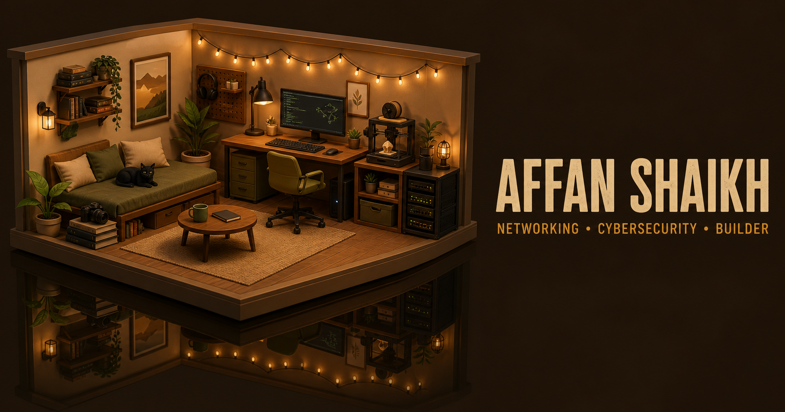

# Affan Shaikh Portfolio

An interactive 3D personal portfolio for Affan Shaikh, a Networking and Cybersecurity student at Ontario Tech University.

[View the live portfolio](https://affan-shaikh-portfolio.sil6428-archtech.workers.dev)



The social cover reflects the current warm cutaway-room direction, with the studio and its darker mirror image shown as one diorama. The favicon remains a compact wireframe room mark.

## Overview

The site presents my technical work, education, experience, and interests without relying on a profile photo. The homepage is a full-screen Three.js cyber lab where each object represents part of my work or personality.

Visitors move the pointer to subtly shift the diorama, drag to orbit within a restrained range, and select any object directly. The computer begins powered off. Selecting its full screen starts a short AFFAN_OS boot sequence and opens a complete desktop environment with folders, files, application search, window controls, a taskbar, system tray, keyboard navigation, and responsive layouts. Other room selections follow a curved, eased camera path into a composed close-up without leaving the scene. Earlier focused routes remain available as unlisted fallbacks.

## Pages

| Route | Purpose |
| --- | --- |
| `/` | Full-screen interactive 3D cyber lab |
| `/info` | Education, skills, experience, volunteer work, resume, and contact links |
| `/interests` | Personal interests and interactive visual cards |
| `/work/archtech` | Archtech case study and current work-in-progress status |
| `/work/ssik` | SSIK consulting website case study |
| `/interests/badminton` | Regional badminton experience |
| `/interests/3d-printing` | 3D printing and design projects |
| `/interests/reading` | Current reading interests |
| `/interests/photography` | Photography and VSCO link |
| `/interests/home-lab` | Proxmox home-lab plans |

## Features

- A focused, full-screen homepage without a conventional header, footer, or visible directory bar
- Expandable project and interest pages
- Custom CSS illustrations for badminton and 3D printing
- Full-screen Three.js cutaway studio with selectable objects and cinematic close-ups
- Compact desktop PC setup that starts as one powered-off screen and boots into a complete original AFFAN_OS interface
- Linux Plasma and Windows-inspired desktop patterns with a top system panel, wallpaper, taskbar, searchable launcher, clock, system tray, running-app indicator, and show-desktop control
- Desktop icons divided into Folders, Documents, and System groups instead of one left-side stack, with folder contents automatically ordered by file type
- A windowed file manager with Home, Projects, Network Labs, Education, Experience, Interests, Contact, and Inspiration folders, plus back, home, breadcrumb, places, status, minimize, maximize, and close controls
- Nested project files for Archtech, SSIK, the portfolio, Password Manager, and Event Planner, alongside degree, certification, employment, volunteer, lab, profile, skills, public contact, photography, reading, and reference files
- Applied-skills documentation that identifies where each networking, security, programming, frontend, Three.js, Cloudflare, Git, Linux, virtualization, web-delivery, and communication skill was used
- A private learning-log record without a public repository link
- An in-system PDF reader for the complete resume, with full-size and download controls
- A functional AFFAN_OS terminal that opens from the taskbar or backtick key, navigates folders and documents, opens the resume, reports portfolio status, and controls room Easter eggs
- Full shutdown behavior: leaving AFFAN_OS turns off the monitor and PC power light, returns to the 3D room, and runs the boot sequence again on the next startup
- One computer interaction marker replaces the retired cluster of six overlapping desktop-file markers
- A continuous boot handoff keeps the monitor on its completed loading frame until the current AFFAN_OS interface is mounted, preventing the retired desktop from flashing between states
- Keyboard-friendly buttons, focus management, live announcements, Escape behavior, readable mobile windows, and a screen-reader power control
- An Inspiration file that credits the interaction, interface, and asset references, with direct links and notes on what each source influenced
- Dark retro monitor interface with the reference-inspired desktop layout, cyan grid, outlined folders, and taskbar
- Pointer-responsive room parallax and lighting that make the diorama feel alive before selection
- Constrained orbit controls with damping for smooth, predictable mouse and touch movement
- Raycast hover anticipation, a lightweight whole-object material accent on pointer hover, focused-object motion, and direct click or tap selection without floor circles
- A simple name-led desktop navigation list placed beside the room, with the compact INDEX menu retained for smaller screens
- A true desktop mirror plane below the raised room platform, darkened to keep the reflection readable, with a polished physical-material fallback on touch-first devices
- A lightweight target cursor and click-spark response influenced by React Bits, implemented locally and disabled for coarse pointers and reduced-motion visitors
- An optional original in-scene object index that provides direct access without restoring the retired bottom directory
- Image-based room lighting generated from Three.js `RoomEnvironment`, giving metal, glass, and clearcoat materials more natural depth without loading an external environment asset
- A compact warm creative-studio redesign with ochre walls, wood flooring, a left lounge and black cat, a right workstation, string lights, and restrained amber, sage, and technical accents
- A scene-loading gate that keeps incomplete geometry and shader compilation out of view until all five external studio assets are ready
- Five locally hosted 1K glTF models from Poly Haven for the camera, armchair, side table, plant, and desk lamp. Their geometry is re-shaded with the room's flat, limited-color material system so external and custom objects share one visual language. All five are released under CC0 and documented in [THIRD_PARTY_ASSETS.md](THIRD_PARTY_ASSETS.md)
- A custom fitted bookshelf replaces the mismatched external shelf model and keeps the books, camera, racket, and printed katana aligned with their supports
- A deterministic, GPU-friendly Three.js `Points` field that adds subtle cyan, violet, and amber signal motes with fewer particles on touch-first devices
- Device-local discovery progress that marks each inspected station without creating an account
- Ambient systems including a synchronized printer carriage and nozzle, moving 3D cat tail, animated yarn ball, pulsing lights, and responsive interaction markers
- A real three-minute printer sequence with a complete miniature black-and-white chess set, printed board, all 32 pieces, a height-tracking print head, live percentage, ETA, completion message, and finish glow
- Curved camera transitions with smoother-step easing, object-relative positions, and offset framing that reserves space for the object file
- Closer room framing plus a shorter wall bookshelf, camera on its top surface, and a mounted badminton racket on the back wall
- A completed katana displayed on the bottom shelf with one continuous white curved blade, a fitted black base collar, compact black fittings and handle, and an interactive relic effect
- A simplified server rack without decorative fans or loose wiring
- Layer-built pawns, rooks, knights, bishops, queens, and kings with distinct silhouettes, checkerboard tiles, and two contrasting armies
- Four separated printer spools in black, orange, purple, and white
- Manual wheel and trackpad zoom after closing an object file, without an automatic camera reset
- Two distinct popup exits: click outside to keep the close-up camera, or use X and Escape to return to the default room angle
- Introduction and camera-help text that appears only at the true default room angle
- Left-drag orbit and right-drag camera panning with the browser menu suppressed over the room
- Tighter room boundaries, a more centered overview, and reduced close-up camera offset
- Brighter ambient lighting with cyan, violet, amber, and mint accents across the desk, rug, shelf, and wall
- Removed the front shelf braces that crossed through the book models
- Refined custom models for the desktop PC, server rack, 3D printer, books, badminton racket, room, and detailed 3D black cat with a bandana, tag, yarn ball, toy mouse, and water bowl
- High-detail geometry pass with softened edges, improved materials, modeled hardware, and object-specific details while retaining a performance-conscious procedural scene
- Beveled monitor, keyboard, mouse, and glass-sided PC tower with visible motherboard traces, internal lighting, cooling rings, webcam, and individual rounded keycaps
- Rear-mounted monitor support with a shortened stand and hinge that stop at the lower bezel without crossing the display
- Detailed printer mechanics including twin threaded Z screws, gantry wheels, bed clips, separated rimmed spools, and a beveled chessboard with ringed piece bases
- Refined server faceplates, network ports, rack screws and status badge without restoring the removed wires or decorative server fans
- Camera focus rings, coated lens glass, viewfinder, rear display and controls, plus book covers, page blocks, page lines, shelf fasteners, racket grommets, and denser strings
- Corrected badminton-racket construction with one slim shaft, a tapered frame ferrule, collar, and compact wall hooks positioned behind the shaft instead of a tennis-style double throat
- Rotation-aware racket mount placement that centres the angled shaft between the two wall hooks
- More expressive cat details including modeled whiskers, mouth, and paw toes
- Adaptive model fidelity that adds desktop-only micro-details while using a lighter geometry path on touch and narrow-screen devices
- Filmic colour mapping, higher desktop pixel density, tuned soft shadows, and studio fill lighting for better depth and material separation
- Physically based glass, coated optics, and lacquer materials on the PC tower, camera lens, racket frame, and katana scabbard
- Additional PC internals including CPU block, graphics card, RGB memory, fan blades, and front ventilation
- Printer bed springs, X-axis belt, stepper motors, extruder grille and fan blades, plus higher-resolution chess-piece layers on desktop
- Mechanically layered hotend with heatsink core and fins, stainless heat break, copper heater block, silicone sock, heater cartridge, thermistor, hex collar, tapered brass nozzle, fine tip, feed tube, and active extrusion thread
- Rebuilt chess families with individual profile curves and recognizable pawn heads, rook crowns, knight snouts and manes, bishop mitres and slashes, queen crown spikes, and king orbs and crosses
- Server handles and perforated rails, camera aperture and lens glint, labelled book spines, a katana scabbard with grip diamonds, and more expressive cat eyes and fur
- Wall decor built directly into the Three.js room, including a framed network-topology display and a three-piece photography-inspired gallery above the bookshelf
- Eleven expanded object files covering Archtech, SSIK, the Proxmox lab, 3D printing, badminton, reading, photography, education, contact details, the resume, and design inspiration
- Retired the page-level 2D cat, its footer house, and its page interactions in favour of the single 3D room cat
- All main portfolio content stays inside the room instead of redirecting to internal pages
- Screen-reader object controls, Escape-to-return behavior, touch support, and unlisted fallback routes
- Mobile-only camera framing, expanded coarse-pointer hit testing, scroll-safe soundtrack and object panels, and 44-pixel phone controls without changing the desktop composition
- Touch-specific room navigation with one-finger camera panning and two-finger orbit plus pinch zoom, while desktop left-drag, right-drag, wheel, and trackpad controls remain unchanged
- Section-specific Three.js network topology on the supporting pages
- Uneven systems-map layout that gives major projects different visual weight
- Spotify playlist link plus device-local audio playback for files the visitor owns
- Original runtime-generated Web Audio sound effects for file interactions, Easter eggs, the room cat, and print completion, with a device-saved on/off control and no third-party recordings
- Hidden interactions for petting the cat, charging the shelf sword, activating a server beacon, changing the room palette, animating the racket, and controlling room secrets from the terminal
- GitHub, LinkedIn, VSCO, email, phone, and resume links
- Metadata, Open Graph images, robots rules, and a generated sitemap
- Motion with reduced-motion support
- Rendered HTML tests for important routes, links, metadata, and private-content checks
- Cloudflare Workers deployment

## Technology

- React 19
- TypeScript 5
- Three.js
- Next.js-compatible routing through Vinext
- Vite 8
- HTML and custom CSS
- Cloudflare Workers and the Cloudflare Vite plugin
- ESLint
- Node.js test runner

## Interaction references

[Ida's Gameboy](https://idas-gameboy.netlify.app/) and [Jesse's Ramen](https://www.jesse-zhou.com/) informed the scene-first direction, subtle pointer response, and fluid transitions between a shared 3D world and its interface. [Bruno Simon's portfolio](https://bruno-simon.com/) informed an earlier game-control experiment, which remains preserved only on the backup branch `backup/rover-world-v6-2026-07-29`. [React Bits](https://reactbits.dev/get-started/introduction) informed the targeted cursor and click-feedback language. Rachel Wei's [live portfolio](https://rachelqrwei.ca/use) and [public repository](https://github.com/rachelqrwei/personalwebsite) clarified the value of named hitboxes, linked whole-object hover feedback, a scene-loading gate, and content layered over one persistent room. This portfolio reimplements those interaction principles independently and keeps its own object index and camera system. The official [Three.js](https://threejs.org/) documentation and examples informed the room's controls, raycasting, physical materials, environment lighting, and efficient point rendering. [Three.js Resources](https://threejsresources.com/category/models) helped locate reputable asset libraries. [Poly Haven](https://polyhaven.com/) supplies the five CC0 furnishing and camera models used in the room. The linked [Sketchfab Project room](https://sketchfab.com/3d-models/project-793e99898ff14f2a89c73a3ccb5d7d10) was used only as visual direction for a brighter studio and is not copied into the project.

The portfolio's concept, code, copy, interface, interactions, and custom interactive models remain original. Rachel Wei's repository has no included licence file, so none of its source code, room model, images, or audio are copied into this project. The only external 3D assets included are the explicitly documented CC0 Poly Haven models.

See [DESIGN_REFERENCES.md](DESIGN_REFERENCES.md) for the complete idea-by-idea reference record and [THIRD_PARTY_ASSETS.md](THIRD_PARTY_ASSETS.md) for every included external asset and its licence.

## Local development

Requirements:

- Node.js 22.13 or newer
- npm

```bash
git clone https://github.com/sil6428/Portfolio.github.io.git
cd Portfolio.github.io
npm install
npm run dev
```

The development server prints its local address after startup.

## Quality checks

```bash
npm run lint
npm test
```

`npm test` creates a production build and checks the rendered output for the main pages and project routes.

## Production build

```bash
npm run build
```

The production site is deployed to Cloudflare Workers:

<https://affan-shaikh-portfolio.sil6428-archtech.workers.dev>

## Project notes

- Archtech remains unreleased and in development. This portfolio only includes information suitable for public viewing.
- The SSIK case study describes my work building the consulting team’s public service website.
- Generated build output, local Cloudflare state, environment files, and deployment metadata are excluded from version control.

## License

Copyright © 2026 Archtech. All rights reserved.

The source is public for portfolio review. Reuse, redistribution, modification, or publication requires prior written permission. See [LICENSE](LICENSE).

Interface sound-effect provenance is documented in [SOUND_EFFECTS.md](SOUND_EFFECTS.md).
